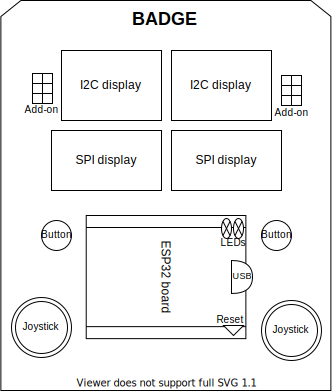

# Badge Labortage/LNI 2021

## Idea: based on Dagbadge/Swagbadge

[Dagbadge](http://www.openhardwareconf.org/wiki/Swagbadge2021_Dagbadge)

[Swag Badge schematics](https://github.com/CCHS-Melbourne/Swag-Badge)

## Sketch

## ESP32 D1 Mini

### Buy

[https://www.az-delivery.de/products/esp32-d1-mini](
https://www.az-delivery.de/products/esp32-d1-mini)

### Pinout

The [ESP32 has VDET pins](https://www.esp32.com/viewtopic.php?t=187) which can
be used for ADC.

#### Joysticks

PS2 joysticks and corresponding caps are [available from Amazon](
https://www.amazon.de/-/en/Replacement-DualShock-Controller-Playstation-Screwdriver/dp/B07R7TM177/)
and probably other sources as well.

The Freetronics Kicad library [has a model for it](
https://github.com/freetronics/freetronics_kicad_library/blob/master/freetronics_footprints.pretty/JOYSTICK_W_BUTTON.kicad_mod).

They have two potentiometers for the two dimensions each, so we assign GPIO pins
to them:

| joystick 1 | joystick 2 |
| ---------- | ---------- |
| IO32, IO34 | IO33, IO35 |

### Firmware

[MicroPython](https://micropython.org/download/esp32/)

## OLED I2C Display

**Note**: On the back, we need to solder a bridge on *one* display
in order to change its address, so we can use both on the same bus.

### Buy

[https://www.az-delivery.de/en/products/0-96zolldisplay](
https://www.az-delivery.de/en/products/0-96zolldisplay)

### Front

### Back

## Other ESP32 Boards

[https://www.mischianti.org/2020/05/30/esp32-pinout-specs-and-arduino-ide-configuration-part-1/](
https://www.mischianti.org/2020/05/30/esp32-pinout-specs-and-arduino-ide-configuration-part-1/)

## Demo

[MicroPython SSD1306 OLED Display Scroll and Shapes](
https://randomnerdtutorials.com/micropython-ssd1306-oled-scroll-shapes-esp32-esp8266/)

### Sources

- [ssd1306.py](
  https://github.com/RuiSantosdotme/ESP-MicroPython/raw/master/code/Others/OLED/ssd1306.py)
- [screen_scroll.py](
https://github.com/RuiSantosdotme/Random-Nerd-Tutorials/raw/master/Projects/ESP-MicroPython/oled/screen_scroll.py)
