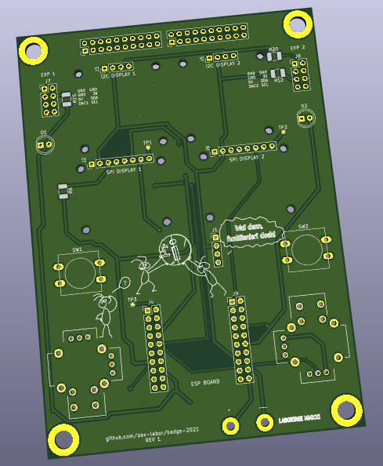

# Badge Labortage 2021


## Idea: based on Swag Badge

The idea for this year's Labor badge is based on the Swag Badge from the
[Open Hardware Miniconf at linux.conf.au 2021](
https://linux.conf.au/programme/miniconfs/open-hardware/).


They also released a DIY version named [Dag Badge](
http://www.openhardwareconf.org/wiki/Swagbadge2021_Dagbadge) as well as the
[Swag Badge schematics](https://github.com/CCHS-Melbourne/Swag-Badge).

## PCB

This is our own PCB design. We will offer a basic kit with the PCB itself, the
ESP32 D1 Mini board, 2 OLED displays, and 2 push buttons, to keep it simple and
inexpensive. Anyone can purchase the additional parts if they like and we may
have some left over from testing, and of course, feel free to fork and rework
the PCB as you like, print it yourself, file PRs, or just leave some feedback.

Size (rounded): 94mm x 130mm



See the [schematics](hw/schematics.pdf) for details.

## ESP32 D1 Mini

The data sheet and documentation for the ESP32-WROOM-32 is [publicly available](
https://www.espressif.com/sites/default/files/documentation/esp32-wroom-32_datasheet_en.pdf).

### Buy

[https://www.az-delivery.de/products/esp32-d1-mini](
https://www.az-delivery.de/products/esp32-d1-mini)

### Pinout


The [ESP32 has VDET pins](https://www.esp32.com/viewtopic.php?t=187) which can
be used for ADC.

### Firmware

Use the `erase.sh` script to clear the SPI flash and `flash.sh` script to flash:
```
./erase.sh
./flash.sh firmware-image.bin
```

**NOTE: One common board is the MH-ET LIVE ESP32 MiniKit. In order to flash it,
you need to short `GPIO0` to `GND` and use the assigned /dev/ttyACM{n} device.**

#### [MicroPython](https://micropython.org/download/esp32/)

It's in beta and we were having trouble getting MQTT and WiFi to work reliably.

Use [`ampy`](https://github.com/scientifichackers/ampy) to upload scripts. On
many OS distributions, you can find a package for it.

#### [NodeMCU](https://nodemcu.readthedocs.io/en/dev-esp32/)

The ESP32 variant is also still in beta, though may do better then MicroPython.
We haven't tested it yet, but it does boot up thus far.

Use [`nodemcu-tool`](https://github.com/AndiDittrich/NodeMCU-Tool) to upload
scripts. If you are using Arch Linux, you can use the [package from the AUR](
https://aur.archlinux.org/cgit/aur.git/tree/PKGBUILD?h=nodemcu-tool). Otherwise,
use the `PKGBUILD` as a reference for building it; mind that you may need to
rebuild the native modules.

Follow the [build instructions](https://nodemcu.readthedocs.io/en/dev-esp32/build/)
for full customization or use a [prebuilt image from the cloud build service](
https://hostile.education/nodemcu-dev-esp32-13-modules-2021-10-17-00-22-29-float.bin).

## Buttons

There are many suitable and colorful [6x6 buttons, tall and high](
https://www.amazon.de/-/en/dp/B087R5XYJW/), though not as nice to
press. We went with the larger [12x12 retro arcade style tactile
push buttons](https://www.amazon.de/-/en/dp/B07WPBQXJ9) instead.

## OLED I2C Display

**Note**: On the back, we need to solder a bridge on *one* display
in order to change its address, so we can use both on the same bus.

The module is based on the SSD1306. See also the [data sheet](
https://cdn-shop.adafruit.com/datasheets/SSD1306.pdf) and
.

### Buy

[https://www.az-delivery.de/en/products/0-96zolldisplay](
https://www.az-delivery.de/en/products/0-96zolldisplay)

### Front


### Back


## Joysticks / Thumbsticks

PS2 joysticks and corresponding caps are [available from Amazon](
https://www.amazon.de/-/en/Replacement-DualShock-Controller-Playstation-Screwdriver/dp/B07R7TM177/)
and probably other sources as well.

The Freetronics Kicad library [has a model for it](
https://github.com/freetronics/freetronics_kicad_library/blob/master/freetronics_footprints.pretty/JOYSTICK_W_BUTTON.kicad_mod).

They have two potentiometers for the two dimensions each, so we assign GPIO pins
to them:

|  function  | left | right |
| ---------- | ---- | ----- |
|   X axis   | IO33 |  IO32 |
|   Y axis   | IO34 |  IO35 |
|   button   | IO5  |  IO12 |

## Other ESP32 Boards

[https://www.mischianti.org/2020/05/30/esp32-pinout-specs-and-arduino-ide-configuration-part-1/](
https://www.mischianti.org/2020/05/30/esp32-pinout-specs-and-arduino-ide-configuration-part-1/)

## Demo

[MicroPython SSD1306 OLED Display Scroll and Shapes](
https://randomnerdtutorials.com/micropython-ssd1306-oled-scroll-shapes-esp32-esp8266/)

### Sources

- [ssd1306.py](
  https://github.com/RuiSantosdotme/ESP-MicroPython/raw/master/code/Others/OLED/ssd1306.py)
- [screen_scroll.py](
https://github.com/RuiSantosdotme/Random-Nerd-Tutorials/raw/master/Projects/ESP-MicroPython/oled/screen_scroll.py)
