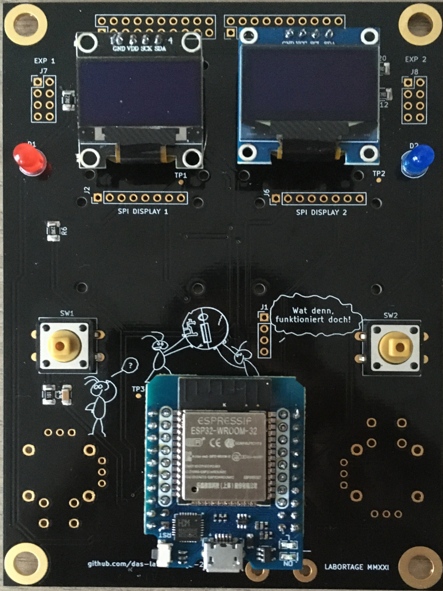
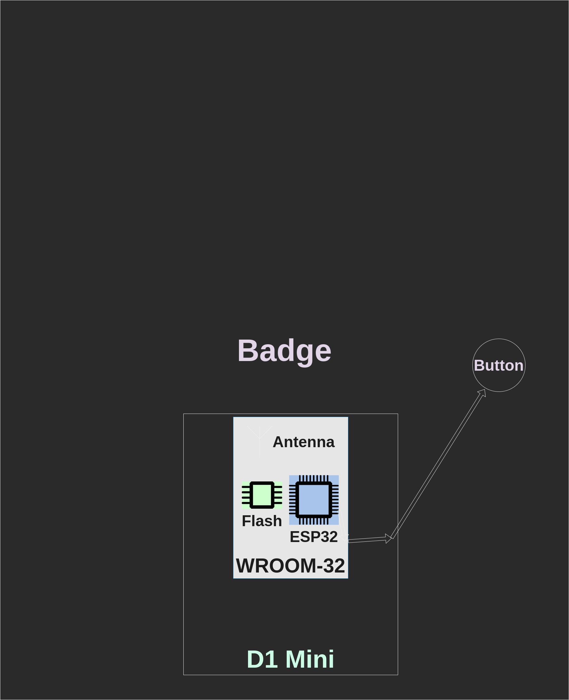

### Agenda

- Badge is not a product!
- Where does my button go?
- Programming
- Extensions

## Badge is not a product!

### Make, not consume

. . .

We designed the badge to be DIY.

. . .

Not the canned food kind of DIY.

. . .

More involved than IKEA.

. . .

You really have to **do** things!

### Soldering the D1 Mini

,,,

## Where does my button go?

### Physical View

{ height=85% }

### Logical View

{ height=85% }

### Schematics

How do I trace a pin?

## Programming

### MicroPython

Python, but for MCUs...

### NodeMCU

Lua....

### Rust

because :crab:

## Extensions

### Thumbsticks

...

### SPI displays

...

### Extra ports

top left/right...

### Prototyping

top area...
