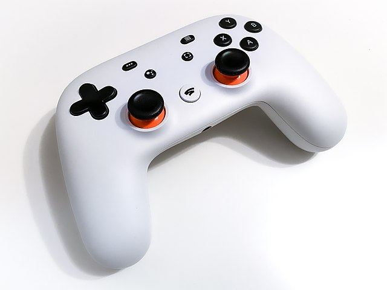
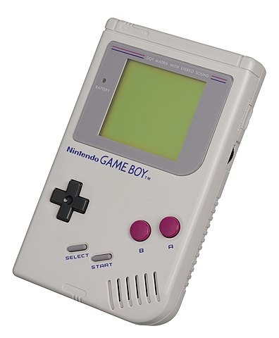

### Agenda

- Badge is not a product!
- Where does my button go?
- Programming
- Extensions

## Badge is not a product!

### Make, not consume

. . .

We designed the badge to be DIY.

. . .

Not the canned food kind of DIY.

. . .

More involved than IKEA.

. . .

You really have to **do** things!

### It looks like...

. . .

:::::::::::::: {.columns}
::: {.column width="60%"}
... a gamepad[^1].

{ width=60% }
:::
::: {.column width="40%"}
. . .

... a handheld console[^2].

{ width=60% }
:::
::::::::::::::

. . .

Yes! We designed the board so that it would fit well in your hands, you could
play with it, or turn it into a gadget of your liking.

For example, you can program it to be a Bluetooth gamepad:
[https://github.com/lemmingDev/ESP32-BLE-Gamepad](
https://github.com/lemmingDev/ESP32-BLE-Gamepad)

[^1]: [https://en.wikipedia.org/wiki/Google_Stadia](
https://en.wikipedia.org/wiki/Google_Stadia)
[^2]: [https://en.wikipedia.org/wiki/Game_Boy](
https://en.wikipedia.org/wiki/Game_Boy)

### Soldering the D1 Mini

,,,

## Where does my button go?

### Physical View

{ height=85% }

### Logical View

{ height=85% }

### Schematics

How do I trace a pin?

## Programming

### MicroPython

Python, but for MCUs...

### NodeMCU

Lua....

### Rust \emoji{crab}

:::::::::::::: {.columns}
::: {.column width="16%"}
{ height=22% }
:::
::: {.column width="25%"}
{ height=25% }
:::
::::::::::::::

Espressif are actively working on Rust support themselves.

They are involved and engaging in the Embedded Rust community, and reachable via
the [esp-rs Matrix channel](https://matrix.to/#/#esp-rs:matrix.org).

[https://github.com/das-labor/badge-2021-rs](
https://github.com/das-labor/badge-2021-rs)

## Extensions

### Thumbsticks

...

### SPI displays

...

### Extra ports

top left/right...

### Prototyping

top area...
