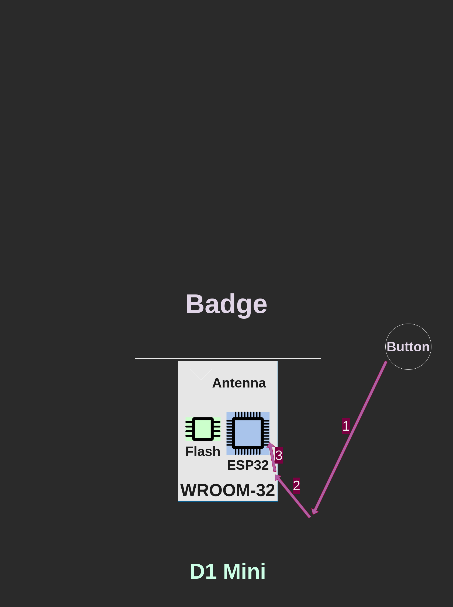

### Agenda

- Badge is not a product!
- Where does my button go?
- Programming
- Extensions

## Badge is not a product!

### Make, not consume

. . .

We designed the badge to be DIY.

. . .

Not the canned food kind of DIY.

. . .

More involved than IKEA.

. . .

You really have to **do** things!

### It looks like...

. . .

:::::::::::::: {.columns}
::: {.column width="60%"}
... a gamepad.

{ width=60% }
:::
::: {.column width="40%"}
. . .

... a handheld console.

{ width=60% }
:::
::::::::::::::

. . .

Yes! We designed the board so that it would fit well in your hands, you could
play with it, or turn it into a gadget of your liking.

For example, you can program it to be a Bluetooth gamepad:
[https://github.com/lemmingDev/ESP32-BLE-Gamepad](
https://github.com/lemmingDev/ESP32-BLE-Gamepad)

### Soldering the D1 Mini

,,,

## Where does my button go?

### Physical View

{ height=85% }

### Logical View

{ height=85% }

### Schematics

How do I trace a pin?

## Programming

### MicroPython

Python, but for MCUs...

### NodeMCU

Lua....

### Rust

because :crab:

## Extensions

### Thumbsticks

...

### SPI displays

...

### Extra ports

top left/right...

### Prototyping

top area...
