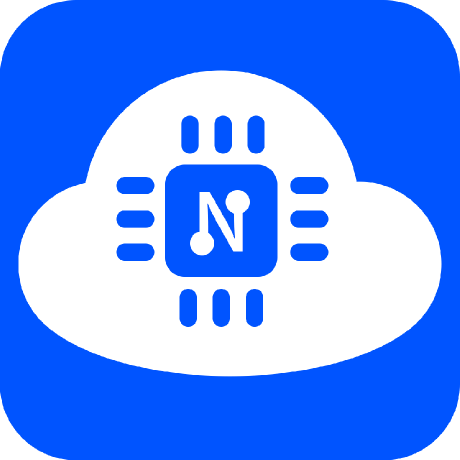

### Agenda

- Badge is not a product!
- Where does my button go?
- Programming
- Extensions

## Badge is not a product!

### Make, not consume

. . .

We designed the badge to be DIY. \emoji{raising-hands}

. . .

Not the canned food kind of DIY. \emoji{canned-food}

. . .

More involved than IKEA. \emoji{screwdriver}

. . .

You really have to **do** things! \emoji{mechanic}

. . .

We provide high level documentation, schematics, board design, example code, and
references, as well as pixel graphics.

[https://github.com/das-labor/badge-2021
](https://github.com/das-labor/badge-2021)

### Physical View

:::::::::::::: {.columns}
::: {.column width="60%"}
{ height=85% }
:::
::: {.column width="40%"}
. . .

#### Basic kit

- a PCB, "the badge"
- SMD parts presoldered
- 1 power LED
- 1 controllable LED
- 2 OLED screens (I2C)
- 2 push buttons
- slot for a D1-Mini board
- a D1-Mini board (ESP32-WROOM-32)
:::
::::::::::::::

### It looks like...

. . .

:::::::::::::: {.columns}
::: {.column width="60%"}
... a gamepad[^1].

{ width=60% }
:::
::: {.column width="40%"}
. . .

... a handheld console[^2].

{ width=60% }
:::
::::::::::::::

. . .

Yes! We designed the board so that it would fit well in your hands, you could
play with it, or turn it into a gadget of your liking.

For example, you can program it to be a Bluetooth gamepad:
[https://github.com/lemmingDev/ESP32-BLE-Gamepad](
https://github.com/lemmingDev/ESP32-BLE-Gamepad)

[^1]: [https://en.wikipedia.org/wiki/Google_Stadia](
https://en.wikipedia.org/wiki/Google_Stadia)
[^2]: [https://en.wikipedia.org/wiki/Game_Boy](
https://en.wikipedia.org/wiki/Game_Boy)

### Soldering the D1 Mini

{ width=100% }

. . .

The D1-Mini has 2x10 pin rows on both sides.

We offer soldering stations, and we sell USB soldering irons.

Ask for help, and other Labor folks will gladly assist. :)

## Where does my button go?

### Logical View

:::::::::::::: {.columns}
::: {.column width="50%"}
{ height=85% }
:::
::: {.column width="50%"}
. . .

The button on the right is routed to the pin rows.

. . .

The pin the button is routed to goes further to the WROOM-32.

. . .

Underneath, it goes further to the actual ESP32 chip.
:::
::::::::::::::

### Schematics

How do I trace a pin?

. . .

Hands-on!

## Programming

### MicroPython

[https://micropython.org/](https://micropython.org/)

> MicroPython is a lean and efficient implementation of the Python 3 programming
> language

{ height=50% }

. . .

Example code and instructions are in the badge repository.

### NodeMCU

[https://nodemcu.readthedocs.io/en/dev-esp32/](
https://nodemcu.readthedocs.io/en/dev-esp32/)

> NodeMCU is an open source Lua based firmware for the ESP32 and ESP8266

{ height=40% }

. . .

Flashing instructions are in the badge repository.

We used it for experimenting. \emoji{technologist}

### Rust \emoji{crab}

:::::::::::::: {.columns}
::: {.column width="16%"}
{ height=30% }
:::
::: {.column width="25%"}
{ height=33% }
:::
::::::::::::::

Espressif are actively working on Rust support themselves.

They are involved and engaging in the Embedded Rust community, and reachable via
the [esp-rs Matrix channel](https://matrix.to/#/#esp-rs:matrix.org).

. . .

We have set up a bare metal Rust app for the badge.

[https://github.com/das-labor/badge-2021-rs](
https://github.com/das-labor/badge-2021-rs)

Getting started instructions are in the repo.

## Extensions

### Thumbsticks and SPI displays

:::::::::::::: {.columns}
::: {.column width="60%"}

:::
::: {.column width="40%"}
If you feel like making [little fun games](
https://mastodon.social/@CyReVolt/106513500102546977), you can add thumbsticks,
widely available as repair parts, and SPI displays, which are also common parts.

Those displays offer more colors and a higher resolution.

. . .

#### DEMO TIME
:::
::::::::::::::

### Extra ports and prototyping

In the top left and right are 2x4 pin headers for extension with I2C, GPIO, 5V,
3.3V, and GND routed to them.

In the top middle area are a host of unrouted pins, which can be used for
prototyping. You can solder anything, attach wires to other pins on the badge,
get fully creative. \emoji{artist}

. . .

Get together, hands on the boards, dive into schematics and manuals, and most
importantly: have fun! \emoji{partying-face}
